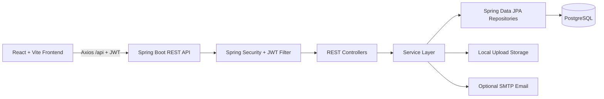

# Architecture

## System Diagram

## Backend Layers

- Controller: request validation, HTTP status codes, response envelopes.
- Service: business workflows, dependency validation, notification creation, RCA review state changes.
- Repository: JPA persistence.
- Security: stateless JWT authentication, BCrypt password hashing, protected APIs.
- Flyway: schema migration at application startup.

## Frontend Layers

- API client: Axios instance with JWT interceptor and shared error handling.
- Contexts: authentication and theme persistence.
- Layout: protected shell with navbar/sidebar/header.
- Pages: API-connected workflows for projects, tasks, Kanban, calendar, notifications, RCA, reports, settings, and profile.
- Components: cards, modals, dialogs, pagination, search, empty/loading/error states.

