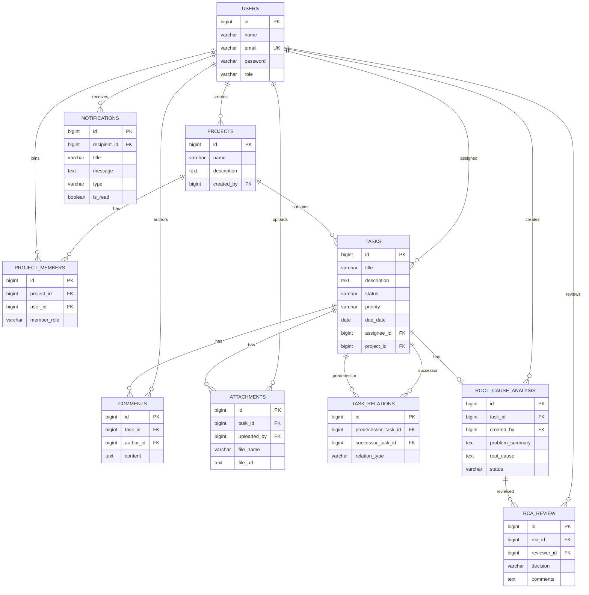

# ER Diagram

```mermaid
erDiagram
    USERS ||--o{ PROJECTS : creates
    USERS ||--o{ PROJECT_MEMBERS : joins
    PROJECTS ||--o{ PROJECT_MEMBERS : has
    PROJECTS ||--o{ TASKS : contains
    USERS ||--o{ TASKS : assigned
    TASKS ||--o{ COMMENTS : has
    USERS ||--o{ COMMENTS : authors
    TASKS ||--o{ ATTACHMENTS : has
    USERS ||--o{ ATTACHMENTS : uploads
    USERS ||--o{ NOTIFICATIONS : receives
    TASKS ||--o{ TASK_RELATIONS : predecessor
    TASKS ||--o{ TASK_RELATIONS : successor
    TASKS ||--o| ROOT_CAUSE_ANALYSIS : has
    USERS ||--o{ ROOT_CAUSE_ANALYSIS : creates
    ROOT_CAUSE_ANALYSIS ||--o{ RCA_REVIEW : reviewed
    USERS ||--o{ RCA_REVIEW : reviews

    USERS {
      bigint id PK
      varchar name
      varchar email UK
      varchar password
      varchar role
    }
    PROJECTS {
      bigint id PK
      varchar name
      text description
      bigint created_by FK
    }
    PROJECT_MEMBERS {
      bigint id PK
      bigint project_id FK
      bigint user_id FK
      varchar member_role
    }
    TASKS {
      bigint id PK
      varchar title
      text description
      varchar status
      varchar priority
      date due_date
      bigint assignee_id FK
      bigint project_id FK
    }
    TASK_RELATIONS {
      bigint id PK
      bigint predecessor_task_id FK
      bigint successor_task_id FK
      varchar relation_type
    }
    COMMENTS {
      bigint id PK
      bigint task_id FK
      bigint author_id FK
      text content
    }
    ATTACHMENTS {
      bigint id PK
      bigint task_id FK
      bigint uploaded_by FK
      varchar file_name
      text file_url
    }
    NOTIFICATIONS {
      bigint id PK
      bigint recipient_id FK
      varchar title
      text message
      varchar type
      boolean is_read
    }
    ROOT_CAUSE_ANALYSIS {
      bigint id PK
      bigint task_id FK
      bigint created_by FK
      text problem_summary
      text root_cause
      varchar status
    }
    RCA_REVIEW {
      bigint id PK
      bigint rca_id FK
      bigint reviewer_id FK
      varchar decision
      text comments
    }
```

